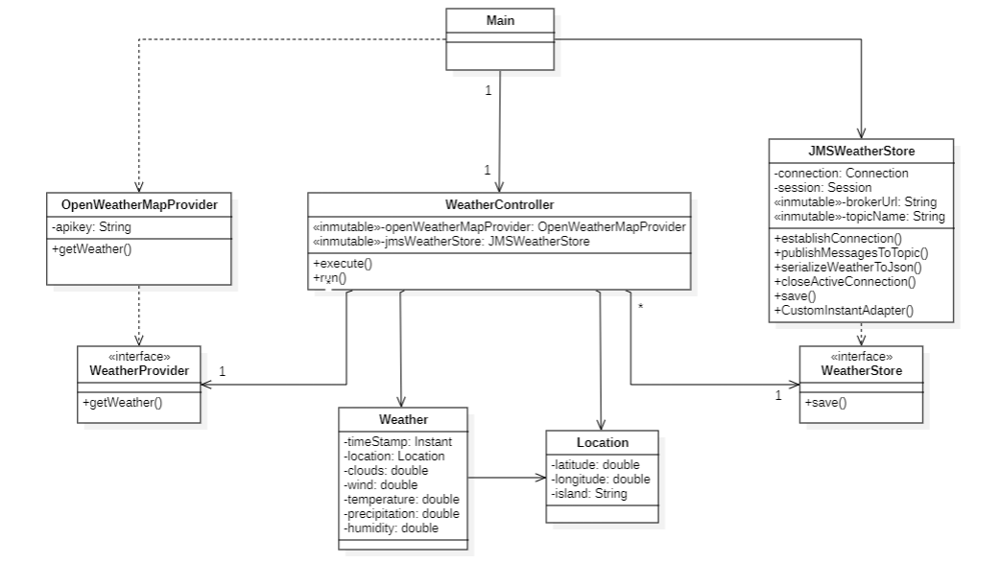
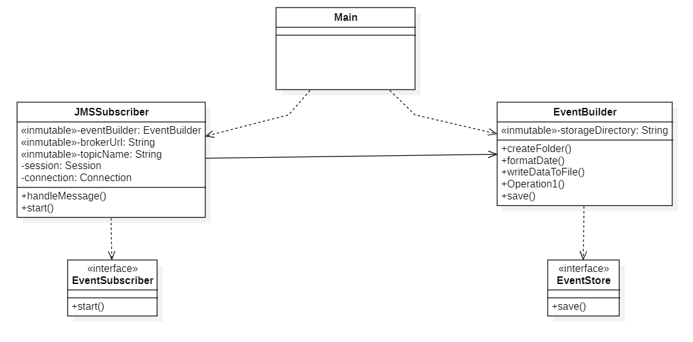

# DACD Practice 2 - Incorporation of Data into the System Architecture
- **Name**: Daniel López Correas
- **University**: Universidad de Las Palmas de Gran Canaria
- **Building**: Escuela de Ingeniería Informática
- **Degree**: Grado en Ciencia e Ingeniería de Datos
- **Course**: 2º year, group 18.43
- **Subject**: Desarrollo de Aplicaciones para la Ciencia de Datos

## Functionality

The system is set up to regulary gather weather details for eight distinct islands in the Canary Islands cluster over the upcoming five days. It emplays the OpenWeatherMap API to collect weather-related specifics such as temperature, chances of precipitation, humidity and cloud cover. Every six hours, the database is refreshed with the latest data, emphasizing the weather forecast for the next five days at noon daily.

"prediction-provider" requests data from the OpenWeatherMap APi every 6 hours to obtain the weather forecast, then, it converts that data into JSON events and sends them to prediction.Weather.

"event-store-builder" subscribe to the prediction.Weather and consume the events to store them in a directory.

## Resources used
### Development enviroment
I've employed the IntelliJ IDEA Integrated Development Environment, developed by JetBrains. The functionalities outlined earlier are powered by Java code (version 17), leveraging additional libraries such as Gson, Jsoup and SQLite.
### Version control system
Throughout the development process, the primary version control system utilized was Git, serving to track alterations and preserve the various versions created.
### Dependencies management
The Maven Project Object Model (POM) file supplied is vital for project management. It delineates crucial project specifics such as organization, name, version and dependencies.
### Documentation
Markdown served as the principal documentation tool for this project. It's a lightweight markup language known for its readibility and simplicity in both writing and comprenhension. Additionally, I've used StarUML for creating the class diagram.

## Design
### Wheater Provider Class Diagram

First, two Plain Old Java Object classes, Weather and Location, were created to extract details from the API's JSON data and assign values to respective variables' attributes. Both clasess belong to the model layer:

- Weather holds weather conditions specifics.
- Location captures geographic data.
- Within the model layer, two interfaces (WeatherProvider and WeatherStore) are present.

Moving to the control layer:

- OpenWeatherMapSupplier class interfaces with the OpenWeatherMap API to retrieve weather data. This class also implements the WeatherProvider interface, mandating the implementation of defined methods.
- JMSWeatherStore
- WeatherController orchestrates weather data request via OpenWeatherMapProvider and manages storage in the database through SQLiteWeatherStore.
- Main class initializes necessary objects within WeatherController and sets the application's execution frequency

### Event Store Builder Class Diagram

 - EventBuilder implements the EventStore interface, creates and stores events following the structure: eventstore/prediction.Weather/{ss}/{YYYYMMDD}.events
 - EventSubscriber implements Subscriber interface and process incoming messages.
 - Main class serves as the starting point of the application.

## How to run the program
To ensure the code runs smoothly, be sure to provide your API key and the database path as arguments within the Main class. Doing so will grant the program access to the essential resources and functionalities it requieres.
