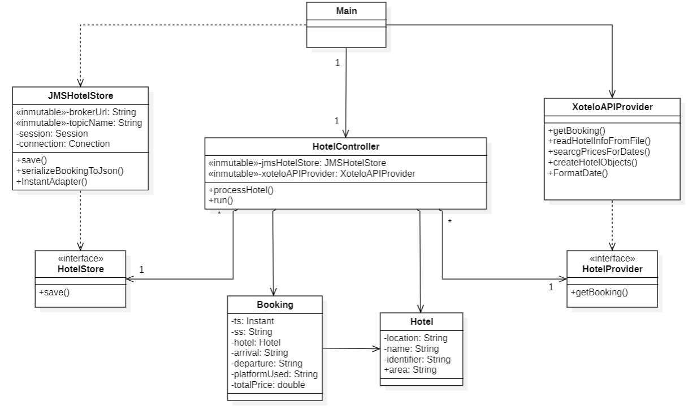

# DACD Final Project - Smart travel planning
- **Name**: Daniel López Correas
- **University**: Universidad de Las Palmas de Gran Canaria
- **Building**: Escuela de Ingeniería Informática
- **Degree**: Grado en Ciencia e Ingeniería de Datos
- **Course**: 2º year, group 18.43
- **Subject**: Desarrollo de Aplicaciones para la Ciencia de Datos

## Functionality

The "Smart Travel Planning" initiative merges accommodation details with meteorological forecasts for the Canary Islands.

The core "Weather Provider" module sources weather predictions from the OpenWeather API, obtaining 5-day forecasts for the 8 islands. This module retrieves data every 6 hours starting at 12 p.m., transmitting updates to the "prediction.Weather" topic. Simultaneously, the "Accommodation Provider" module interfaces with the Xotelo API, fetching nightly hotel prices at 6-hour intervals and forwarding this data to the "prediction.Booking" topic.

Handling data organization, the "Datamart Store Builder" module subscribes to the broker, organizing event storage in the "datalake" directory. Events are serialized into specific files within this directory, delineated by their topics and organized by date.

Additionally, a user-centric "Travel Planner" module creates datamarts, combining stay options with accurate weather predictions for each island on specific days. This empowers the platform to offer diverse accommodation choices matched with precise meteorological insights to users.

## Resources used
### Development enviroment
I've employed the IntelliJ IDEA Integrated Development Environment, developed by JetBrains. The functionalities outlined earlier are powered by Java code (version 17), leveraging additional libraries such as Gson, Jsoup and SQLite.
### Version control system
Throughout the development process, the primary version control system utilized was Git, serving to track alterations and preserve the various versions created.
### Dependencies management
The Maven Project Object Model (POM) file supplied is vital for project management. It delineates crucial project specifics such as organization, name, version and dependencies.
### Documentation
Markdown served as the principal documentation tool for this project. It's a lightweight markup language known for its readibility and simplicity in both writing and comprenhension. Additionally, I've used StarUML for creating the class diagram.
### API used
API OpenWeatherMap: https://openweathermap.org/forecast5
API Xotelo --> https://xotelo.com/

## Design
### Prediction Provider Class Diagram

First, two Plain Old Java Object classes, Weather and Location, were created to extract details from the API's JSON data and assign values to respective variables' attributes. Both clasess belong to the model layer:

- Weather holds weather conditions specifics.
- Location captures geographic data.
- Within the model layer, two interfaces (WeatherProvider and WeatherStore) are present.

Moving to the control layer:

- OpenWeatherMapSupplier class interfaces with the OpenWeatherMap API to retrieve weather data. This class also implements the WeatherProvider interface, mandating the implementation of defined methods.
- JMSWeatherStore
- WeatherController orchestrates weather data request via OpenWeatherMapProvider and manages storage in the database through SQLiteWeatherStore.
- Main class initializes necessary objects within WeatherController and sets the application's execution frequency

### Datalake Builder Class Diagram

 - EventBuilder implements the EventStore interface, creates and stores events following the structure: eventstore/prediction.Weather/{ss}/{YYYYMMDD}.events
 - EventSubscriber implements Subscriber interface and process incoming messages.
 - Main class serves as the starting point of the application.

### Hotel Provider Class Diagram

- HotelController: Extends TimerTask, indicating it's a task executed at regular intervals. Retrieves bookings using XoteloAPIProvider and saves them using JMSHotelStore.
- XoteloAPIProvider (implements HotelProvider): Reads hotel information from a file. Uses an API to fetch booking prices and creates Booking objects.
- JMSHotelStore (implements HotelStore):Handles storing bookings in a JMS (Java Message Service) system using ActiveMQ. Serializes Booking objects to JSON and sends them to a topic for storage.
- HotelProvider (interface): Defines a getBooking() method to retrieve hotel bookings.
- HotelStore (interface): Defines a save() method to store hotel bookings.
- Main: Sets up and runs a controller (HotelController) as a scheduled task with a time interval using a Timer.

### Travel Business Unit Class Diagram

- DataHandler: Handles database operations like initialization, table creation, and data insertion. Formats date, adds weather and hotel data to their respective tables, and removes tables as needed. Utilizes a DbConnector to establish and manage database connections.
- DbConnector: Provides a method to connect to an SQLite database using JDBC (connectDatabase()). Handles establishing connections to the specified database.
- Main: Sets up MessageHandler instances for weather and booking prediction messages, each utilizing a DataHandler to process and manage data. Initializes the message handlers to start consuming messages.
- ModelBuilder: Constructs Weather and Hotel objects from JSON data obtained from the messages. Parses JSON data into respective object models (buildWeatherData() and buildHotelData()).
- MessageHandler: Manages message consumption from a specified topic via JMS. Initiates scheduled tasks to clear tables at regular intervals and processes incoming messages. Uses a DataHandler to add weather or hotel data to the database based on the message topic.
- InfoProvider: This class interacts with users by prompting them to input a date in the format 'yyyy-MM-dd'. Displays the best hotel option to the user based on the specific date provided.
